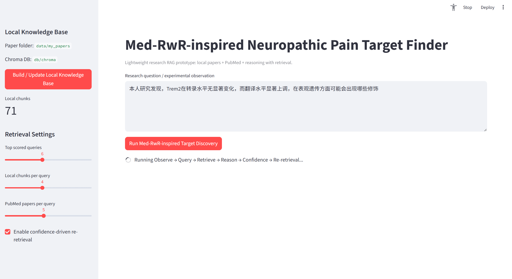
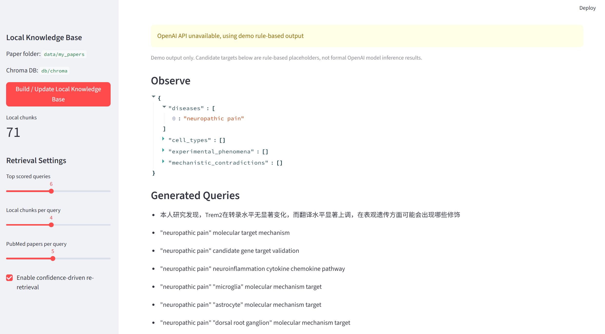
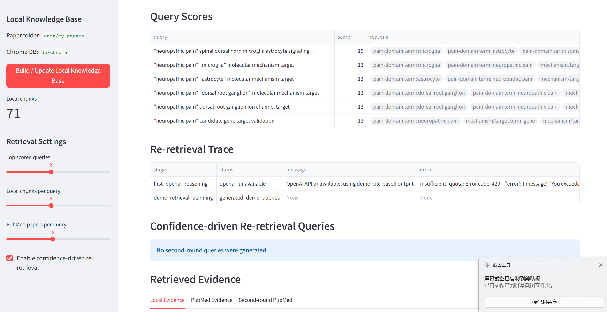
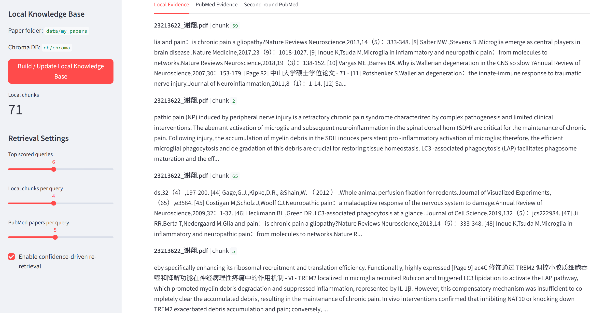
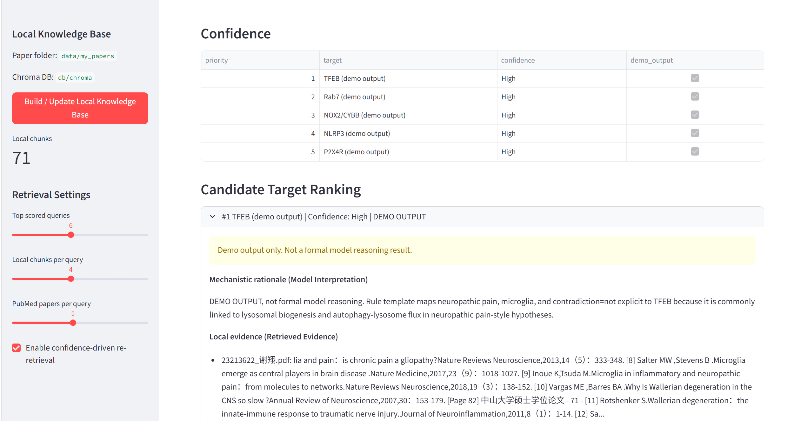

# Med-RwR-inspired Research RAG Target Finder

This is a lightweight, runnable biomedical research RAG prototype for neuropathic pain target discovery.

It is inspired by the reasoning-with-retrieval idea in Med-RwR, but it does not reproduce the original paper and does not train a medical model.

The goal of this project is to demonstrate how a biomedical AI system can combine local research materials, PubMed/NCBI retrieval, query scoring, evidence tracing, confidence estimation, and candidate target ranking to support evidence-grounded biomedical hypothesis generation.

This project is for educational and research-prototype purposes only. It is not a clinical tool.

---

## Project Motivation

General-purpose large language models may provide overly broad or generalized answers to specialized biomedical research questions.

In biomedical research, especially molecular target discovery, it is important to ground reasoning in traceable evidence from local research documents and external biomedical literature.

This project explores a reasoning-with-retrieval style workflow:

```text
Observe → Query → Retrieve → Score → Reason → Confidence → Re-retrieve → Rank
```

The system is designed to support biomedical researchers in organizing research observations, retrieving relevant evidence, and prioritizing candidate molecular targets in a transparent way.

---

## Core Idea

The prototype focuses on neuropathic pain and neuroinflammation-related target discovery.

It takes a research question or experimental observation as input, then:

- extracts biomedical entities and research context;
- generates retrieval queries;
- scores candidate queries;
- retrieves local evidence from personal research documents;
- retrieves external evidence from PubMed/NCBI;
- traces the evidence used for reasoning;
- estimates confidence;
- triggers second-round retrieval when evidence is insufficient;
- ranks candidate molecular targets with supporting evidence.

---

## Main Features

- Local biomedical knowledge base from research papers and notes;
- Chroma-based vector retrieval;
- PubMed/NCBI literature retrieval;
- Query generation and query scoring;
- Evidence tracing from local and external sources;
- Confidence-driven re-retrieval workflow;
- Candidate molecular target ranking;
- Streamlit-based interactive interface;
- Fallback demo mode when OpenAI API is unavailable.

---

## Project Structure

```text
research-rag-target-finder/
├── app.py
├── README.md
├── requirements.txt
├── .env.example
├── data/
│   └── my_papers/
├── db/
├── outputs/
├── src/
│   ├── ingest.py
│   ├── retriever.py
│   ├── pubmed.py
│   ├── prompts.py
│   ├── query_generator.py
│   ├── query_scorer.py
│   ├── evidence.py
│   ├── confidence.py
│   ├── target_ranker.py
│   └── workflow.py
└── assets/
    ├── demo_home.png
    ├── observe_generated_queries.png
    ├── query_scores_reretrieval_trace.png
    ├── retrieved_local_evidence.png
    └── candidate_target_ranking.png
```

---

## Assets

The `assets/` folder contains screenshots used in this README to visually demonstrate the Streamlit interface and workflow outputs.

Current screenshots include:

```text
assets/
├── demo_home.png                          # Streamlit home interface
├── observe_generated_queries.png          # Observation parsing and generated retrieval queries
├── query_scores_reretrieval_trace.png     # Query scores and re-retrieval trace
├── retrieved_local_evidence.png           # Retrieved local biomedical evidence
└── candidate_target_ranking.png           # Candidate molecular target ranking
```

These screenshots are for documentation and demonstration purposes only.

---

## Demo Screenshots

### 1. Streamlit Interface

The home interface allows the user to input a biomedical research question or experimental observation, configure retrieval settings, and run the Med-RwR-inspired target discovery workflow.



---

### 2. Observation and Generated Queries

The system parses the input observation and generates multiple retrieval queries related to disease mechanisms, cell types, inflammatory pathways, and molecular targets.



---

### 3. Query Scores and Re-retrieval Trace

The project includes a query scoring step to prioritize mechanism-aware retrieval queries.

It also records a re-retrieval trace to show whether additional retrieval is triggered when evidence is insufficient.



---

### 4. Retrieved Local Evidence

The system retrieves relevant evidence from local research documents and displays evidence snippets with document-level traceability.



---

### 5. Candidate Target Ranking

The final output ranks candidate molecular targets with confidence information and supporting evidence.

This ranking is intended to support biomedical hypothesis generation rather than clinical decision-making.



---

## Algorithmic Design

This project demonstrates a modular biomedical RAG workflow.

### 1. Observation Parsing

The input research question or experimental observation is parsed into disease context, biological phenomena, cell types, and possible mechanistic contradictions.

### 2. Query Generation

The system generates multiple biomedical retrieval queries related to:

- disease mechanisms;
- microglia and neuroinflammation;
- molecular target discovery;
- lysosomal dysfunction;
- autophagy and phagocytosis;
- spinal dorsal horn and neuropathic pain.

### 3. Query Scoring

Generated queries are scored using transparent biomedical rules.

Queries containing disease terms, cell-type terms, mechanism terms, and target-related terms are prioritized.

### 4. Evidence Retrieval

The system retrieves evidence from:

- local research documents;
- local vector database;
- PubMed/NCBI biomedical literature.

### 5. Evidence Tracing

Retrieved evidence is displayed separately from model interpretation, helping users distinguish source evidence from generated reasoning.

### 6. Confidence-driven Re-retrieval

If the initial evidence is insufficient, the system can trigger a second retrieval round to search for more targeted biomedical evidence.

### 7. Candidate Target Ranking

Candidate molecular targets are ranked according to retrieved evidence, mechanistic relevance, and confidence information.

---

## Example Research Question

```text
I study neuropathic pain after peripheral nerve injury.
My experiment suggests microglial activation and inflammatory cytokines increase in the spinal dorsal horn,
but one candidate pathway seems inconsistent across time points.
Please identify candidate molecular targets and validation experiments.
```

The system generates mechanism-aware queries, retrieves local and PubMed evidence, and ranks possible candidate targets for further experimental validation.

---

## How to Run

Create a virtual environment:

```bash
python -m venv .venv
```

Install dependencies:

```bash
.venv\Scripts\python.exe -m pip install -r requirements.txt
```

Run the Streamlit app:

```bash
.venv\Scripts\python.exe -m streamlit run app.py
```

If the default port is occupied, use another port:

```bash
.venv\Scripts\python.exe -m streamlit run app.py --server.port 8505
```

Then open the local URL shown in the terminal.

---

## Environment Variables

This project may use an OpenAI API key for model-based reasoning.

Create a `.env` file based on `.env.example`:

```text
OPENAI_API_KEY=your_api_key_here
```

If the OpenAI API is unavailable, the project can run in fallback demo mode to illustrate the workflow structure.

Do not upload your real `.env` file to GitHub.

---

## What This Project Demonstrates

This project demonstrates:

- biomedical RAG system development;
- reasoning-with-retrieval inspired workflow design;
- local knowledge base construction;
- PubMed/NCBI retrieval integration;
- query generation and query scoring;
- evidence tracing;
- confidence-driven re-retrieval;
- candidate molecular target ranking;
- AI-assisted biomedical hypothesis generation.

---

## Limitations

This project is a lightweight educational prototype.

It does not:

- reproduce the original Med-RwR paper;
- train a medical model;
- provide clinical diagnosis;
- replace expert biomedical interpretation;
- use real patient data;
- claim validated clinical performance.

The retrieved evidence and candidate target ranking should be interpreted as research support, not medical advice.

---

## Privacy and Safety Note

This demo should only be used with non-sensitive research documents.

Do not upload private patient information, confidential clinical records, or unpublished sensitive research data.

The project is intended for educational, research-prototype, and algorithmic workflow demonstration purposes only.